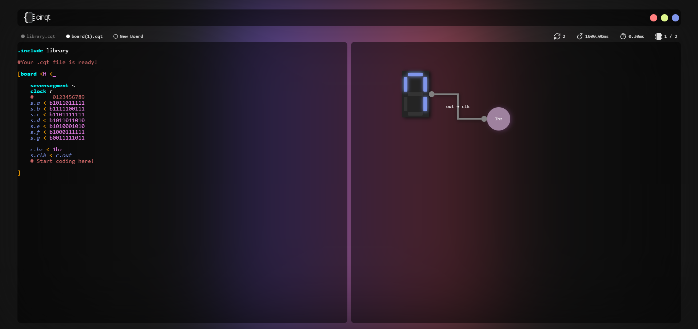

A programming language where you write code that "compiles" into circuits

# Documentation

### Types, Constants, Gates, Operators

**Types**
- Hertz: describes a clock. (`500hz`,`5hz`)
- Voltage: describes a voltage given. (`5v`,`3.3v`)

**Constants**
- Ground: `_`
- High: `H`
- Low: `L`

**Gates**
There are 3 elementary gates wich can be combined in 7 correct variations.

- AND: `&`
- OR: `|`
- NOT: `!`

Combining them:
- NAND: `!&`
- NOR: `!|`
- XOR: `x|`
- XNOR: `x!|`

**Operators**

- Assignment operators: `<` `>`
- Circuit enclosing operators: `[` `]`
- Boolean operators: `?` `:`